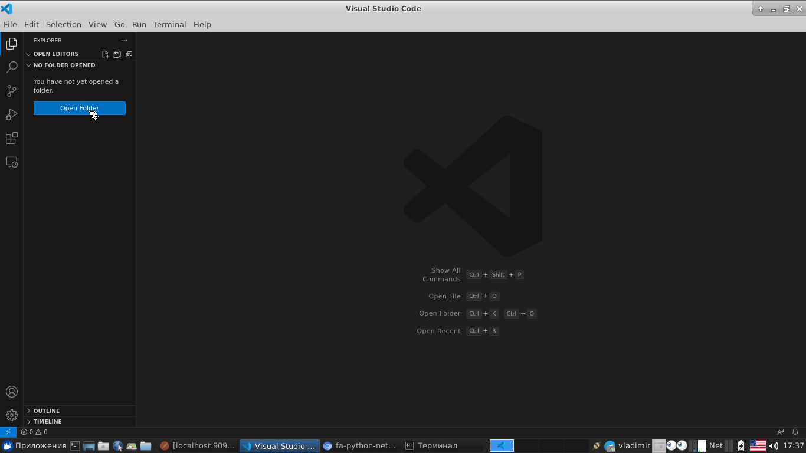
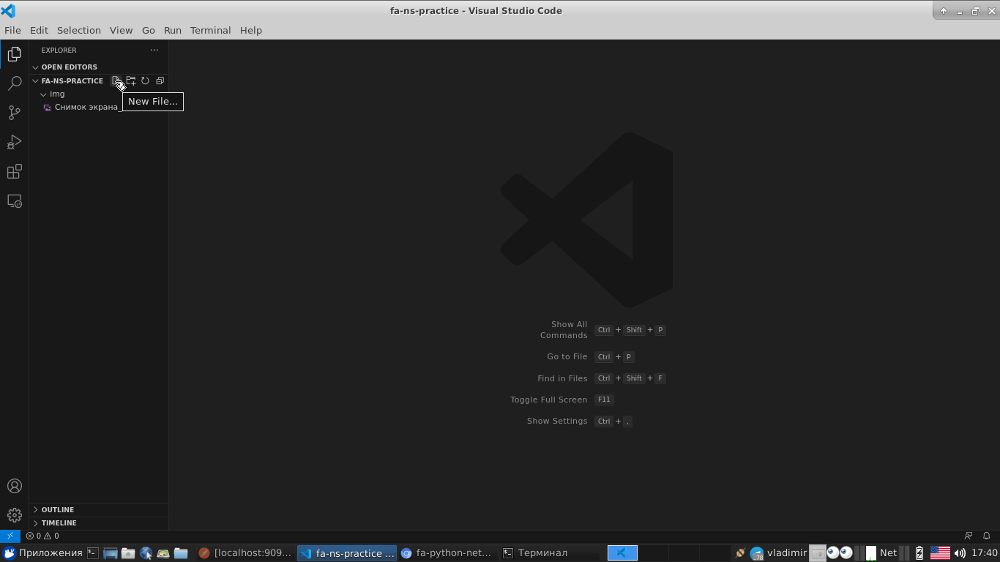
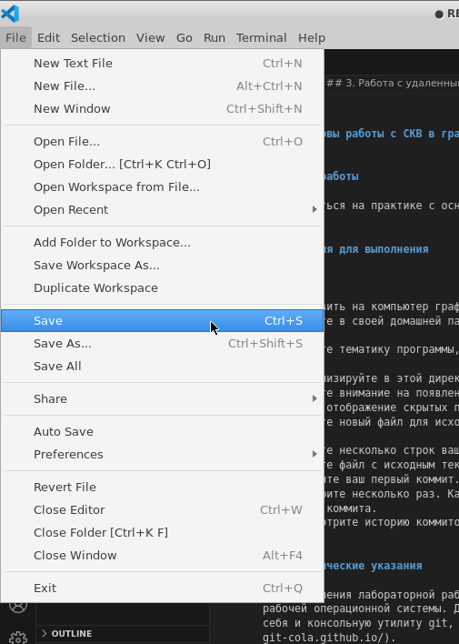

## Семинарские занятия по теме git
_____

Цель: Нам нужно смержить ветки, выполнив следующие команды:

```
git init

git add .

git commit -m " test this app"

git remote add origin https://github.com/username/0-git-basic.git

git push  origin master


git branch hello

git checkout hello

git add .

git commit -m " add hello to hello"

git push  origin hello

git checkout master

git merge hello

git push  origin master
```

Создаем каталог на компьютере где будет лежать наш проект
 - 

 Создаем файл README.md
 - 

Заполняем файл рандомным текстом, чтобы он не был пустым

 - 

 Сохраняем файл, иначе пустой файл не запушится в репозиторий
 - 
 
 
 Коммитим изменения

 Равносильно двум подряд командам 
       git add
       git commit

 - 

 - 

 - 
 - 
 - 

 Пушим в репозиторий (если до этого настроили github в vscode)
 - 
 - 
  
  Если vscode не настроен, то список репозиториев будет недоступен.

 - 

  Тогда идём создавать репозиторий вручную на сайт githib.com
 - 
 - 


 - 
 - 
  
  Теперь выбираем из списка только что созданный репозиторий 
  
  
  
 В строке должны увидеть список своих репозиториев.
  Если списка нет, то настраиваем аутентификацию с github

  ```
  git config --global user.name "vladimir"
  git config --global user.email "email@address.com"
  ```

  и пушим в него


 - 

Идём смотреть, что получилось. Обращаем внимание на ветку master
 - 

Создаем файл hello.py
 - 
 Создаем новую ветку (git branch hello), переключаемся на неё (git checkout hello) 
 - 
 Пушим изменения в репозиторий ветку hello , наблюдаем что там на github
 - 
 - 
 - 
 Переключаемся в ветку master (git checkout master)
 - 
 - 
 Сливаем ветку hello в master
 - 


 - 
 Пушим изменения ветки master
 - 
 - 
 Смотрим, что ветки слились
 - 